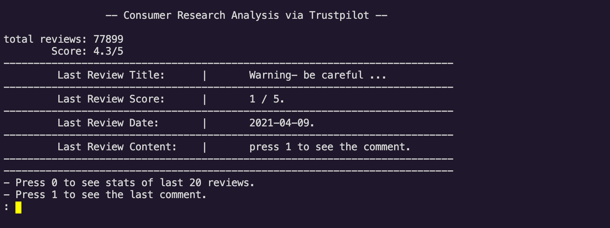
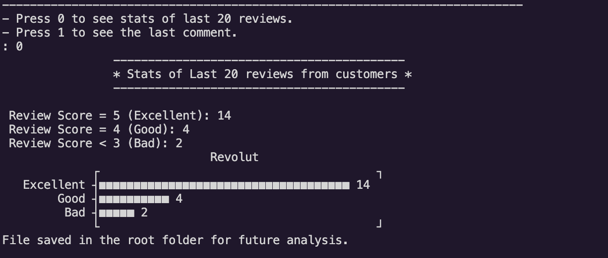
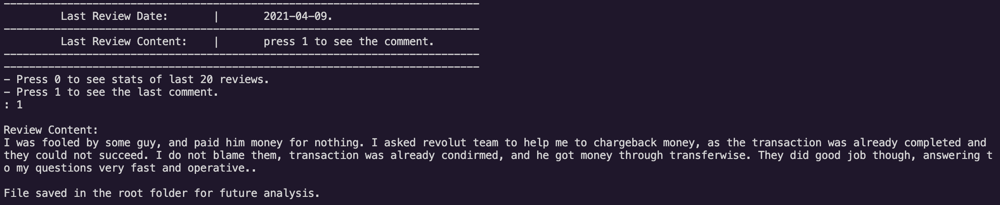

# Consumer_Research_With_Nokogiri
A pratical use of Nokogiri gem to research on product consumer satisfaction.
## Overview
This project is focusing on showing the use of web scraping for a digital marketing business purpose. To improve a product, most companies rely on different services or software, the implementation of scrapy here is one way on how web scraping can help achieving Consumer Research.

For this project, I targeted Revolut as the main brand.
Revolut is an English Financial Technology Company headquartered in London. You can can find out more about this company [here](https://en.wikipedia.org/wiki/Revolut).

## Scrapy
Scrapy collects the last 20 reviews from Trustpilot, a well known platform to write a review, and display to the user a nice stat about those reviews. All in the terminal.
Finally, it saves the results into a file for further use.

## Screenshot




## Built With

-  Ruby
- Nokogiri
- unicode plot
- httparty
- Vscode (Wish it was Vim :-)) 

## Getting Started

Let us guide you through how you can get our repository in your local machine.

### Prerequisites
- First, you need to make sure you have a text editor already installed in your machine. We used Vscode if you don't have anyone you can download it for free.
- Second most important is to make sure you've Ruby installed on your machine. type this in your terminal to make sure you are alright.

```console
ruby -v
```

### Setup

Know we are sure you have the minimum requirements, you can follow those instructions to get our reposiroty :

* Open your terminal and locate yourself on the folder you want to clone the repository by using the command cd.

* Setup

Create a new folder/directory for the project.
Be sure to have a Github account and that this account is connected locally on your PC.

* Install

  In the desired directory on your terminal
  ```
  git clone git@github.com:Anvi98/Consumer_Research_With_Nokogiri.git
  ```
  Before moving to the repository cloned, run in you terminal:
  ````
  bundle install
  ````
To make sure you have all gems installed.

* Move to the repository cloned

```
cd Consumer_Research_With_Nokogiri/
```
Then if you are running a unix machine type direclty main to run the program
````
bin/scrapy
````
or 
```
ruby bin/scrapy
```
if you are on Windows.

## Note for testing

If you wish to take a look on the different tests, you can easily find the test_spec file in the folder spec in the root of the project.

- To run the tests, type in your terminal:
````
rspec
````
you should make sure to be in the root of the project before typing this command.

ENJOY !!

## Authors

👤 **Anvi Alex**

- GitHub: [Anvi98](https://github.com/anvi98)
- Twitter: [@anvi_al](https://twitter.com/anvi_al)
- LinkedIn: [LinkedIn](https://www.linkedin.com/in/anvi-alex-eponon/)

## 🤝 Contributing

Contributions, issues, and feature requests are welcome!

Feel free to check the [issues page](https://github.com/Anvi98/Consumer_Research_With_Nokogiri/issues).

## Show your support

Give a ⭐️ if you like this project!


## 📝 License

This project is [MIT](LICENSE) licensed.

